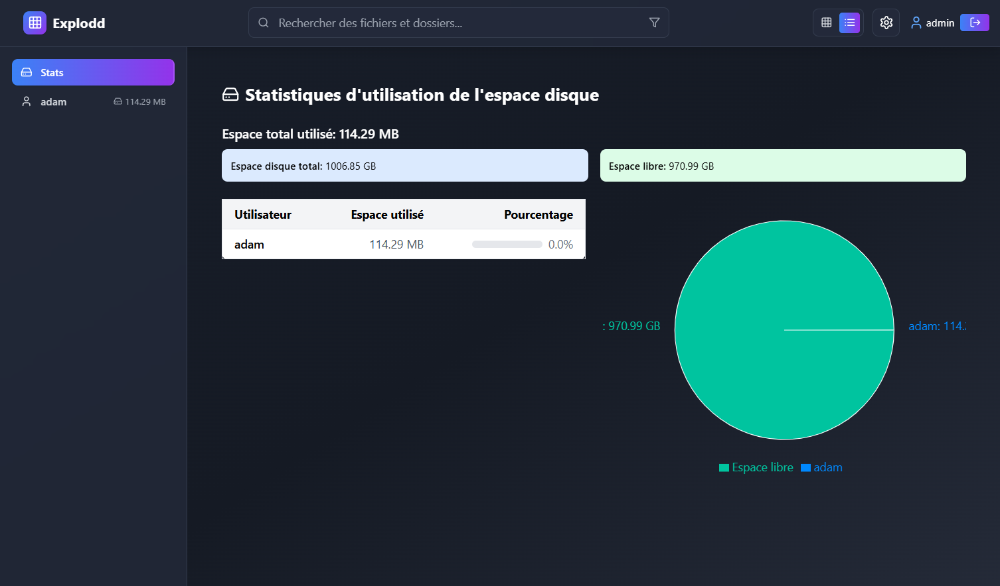

# Explodd


Explodd est une application web moderne de gestion et partage de fichiers, conçue pour offrir une expérience utilisateur intuitive et responsive sur tous les appareils.

## Fonctionnalités principales

### Gestion de fichiers
- **Navigation intuitive** : Parcourez facilement vos fichiers et dossiers avec une interface claire et moderne
- **Sélection multiple** : Sélectionnez plusieurs fichiers pour effectuer des actions groupées
- **Prévisualisation** : Affichez un aperçu des images, vidéos et documents directement dans l'application
- **Recherche avancée** : Trouvez rapidement vos fichiers avec la recherche par nom, type ou contenu
- **Filtrage par type** : Filtrez vos fichiers par catégorie (images, vidéos, audio, documents)
- **Affichage personnalisable** : Basculez entre la vue grille et la vue liste selon vos préférences

### Actions sur les fichiers
- **Téléchargement** : Téléchargez des fichiers individuels ou en lot
- **Renommage** : Modifiez facilement le nom de vos fichiers et dossiers
- **Suppression** : Supprimez les fichiers et dossiers dont vous n'avez plus besoin
- **Déplacement** : Organisez vos fichiers en les déplaçant entre les dossiers
- **Création** : Créez de nouveaux dossiers pour organiser votre contenu
- **Partage** : Partagez vos fichiers avec d'autres utilisateurs via des liens

### Gestion des utilisateurs
- **Authentification sécurisée** : Connexion et inscription sécurisées
- **Profils utilisateurs** : Gestion des informations personnelles
- **Système de permissions** : Contrôle précis des droits d'accès aux fichiers et dossiers
- **Espaces personnels** : Chaque utilisateur dispose de son propre espace de stockage

### Interface responsive
- **Design adaptatif** : Interface optimisée pour ordinateurs, tablettes et smartphones
- **Menu mobile** : Menu d'actions spécifique pour les appareils mobiles
- **Performance optimisée** : Chargement rapide même sur connexions lentes

## Technologies utilisées

### Frontend
- **React** : Bibliothèque JavaScript pour construire l'interface utilisateur
- **TypeScript** : Typage statique pour un code plus robuste
- **Tailwind CSS** : Framework CSS utilitaire pour un design responsive
- **Lucide React** : Icônes modernes et minimalistes
- **React Router** : Gestion du routage côté client

### Backend
- **Node.js** : Environnement d'exécution JavaScript côté serveur
- **Express** : Framework web minimaliste pour Node.js
- **JWT** : Authentification sécurisée avec JSON Web Tokens
- **Multer** : Middleware pour la gestion des téléchargements de fichiers
- **Système de fichiers** : Stockage direct des fichiers sur le système de fichiers

### Déploiement
- **Docker** : Conteneurisation de l'application pour un déploiement simplifié
- **Nginx** : Serveur web haute performance pour servir l'application frontend

## 📊 Statistiques et gestion des utilisateurs

<div align="center">
  
</div>

<div align="center">
  
</div>

## 🚀 Installation

### Installation classique

```bash
# Cloner le dépôt
git clone https://github.com/votre-nom/explodd.git
cd explodd

# Installer les dépendances du frontend
npm install

# Installer les dépendances du backend
cd server
npm install
cd ..

# Démarrer l'application en mode développement
npm run start
```

### Installation avec Docker

Voir le fichier [README.docker.md](./README.docker.md) pour les instructions détaillées sur le déploiement avec Docker.

## ⚙️ Configuration

### Environnement standard

Le fichier `.env` à la racine du projet et le fichier `server/.env` permettent de configurer différents aspects de l'application en mode développement ou déploiement standard :

- Ports du serveur
- Connexion à la base de données
- Chemins de stockage des fichiers
- Clés secrètes pour JWT
- Et plus encore...

### Environnement Docker

En mode Docker, la configuration se fait directement via :

- Le fichier `docker-compose.yml` pour les variables d'environnement et la configuration des services
- La variable d'environnement `EXPLODD_FILES_PATH` pour définir le chemin des fichiers à monter dans le conteneur

## 📸 Captures d'écran

<div align="center">
  
  *Vue principale de l'application avec la grille de fichiers*
</div>

<div align="center">
  
  *Interface mobile avec menu d'actions*
</div>

## Contribuer

Les contributions sont les bienvenues ! N'hésitez pas à ouvrir une issue ou à soumettre une pull request.

## Licence

[MIT](./LICENSE)

